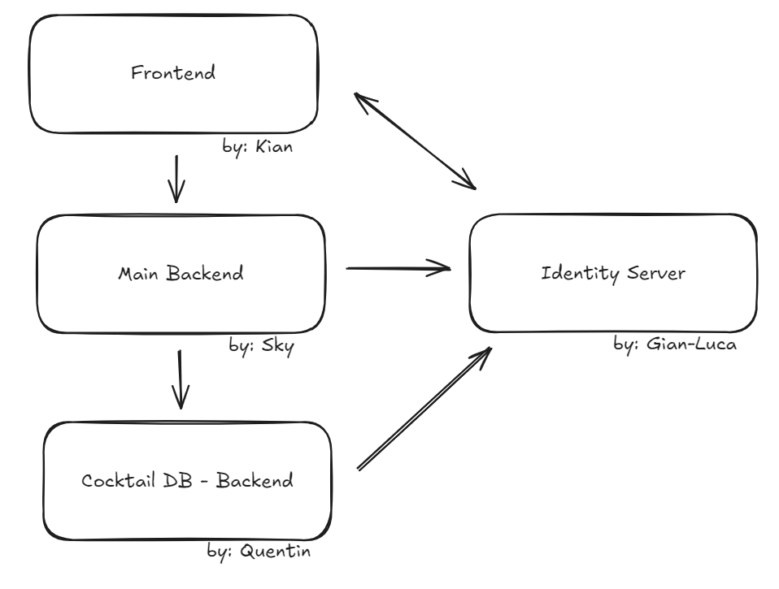

# M321_LB2

## Gruppe
Gian-Luca, Kian, Quentin, Sky

## Overview

In this Application you can manage different Cocktails as well as adding guests to the guestbook.
There are detailed recipes on every single available Cocktail.
You can also add available ingredients so that when adding a cocktail, it's obvious which ingredients are at disposal.

### Frontend
- UI to manage other components
### Main Backend
- API for Bottles and guestbook with delete/post/put/get capabilities
### Cocktail Backend
- API for Cocktails with delete/post/put/get capabilities
### Identity Server
- Manages Users and Authorizations
